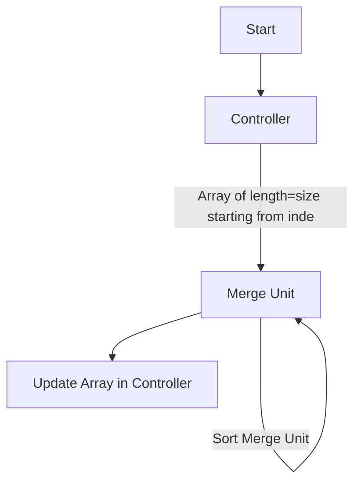
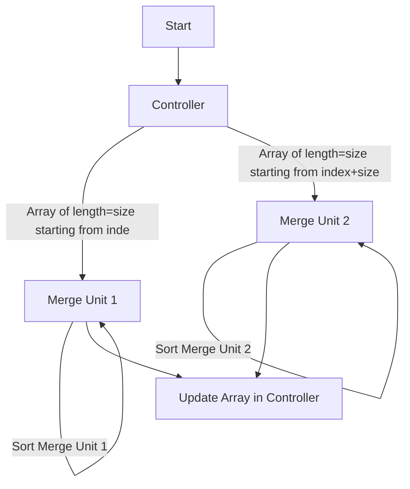

# System Defination
Here we define the system architecture, and how we defined our program as 

## Linear System
### All State Variables
Initial State X<sup>0</sup> = {array [....], index=1, mergeUnit=[], cur=0, mu_sorted=True, mu_merged=True}
### Flow

### Description
Here our Controller passes out values from initial array to merge unit where it gets merged sorted and replaced back internally in the original Array. 
In this We have S1 as Linear system, Controller C1 and Merge Unit M1.  
```
S1 is a compositon of C1 and M1. 
C1 = {array, index, sortStatus, size}
M1 = {mergeUnit,sortStatus,MergeStatus}
```
* At every iteration C1 passes a sub array starting from ```index``` to ```size``` to ```mergeUnit in M1```
* M1 internally sorts the mergeUnit
* Merges the mergeUnit in the position in array in S1. 


## Parallel System
### All State Variables
Initial State X<sup>0</sup> = {array [....], index=1, mergeUnit1=[], mergeUnit2=[] cur=0, mu1_sorted=True, mu1_merged=True, mu2_sorted=True, mu2_merged=True}

### Flow


### Description
Here our Controller passes out values from initial array to merge unit(s) where it gets merged sorted and replaced back internally in the original Array. 
In this We have S1 as Linear system, Controller C1 and Merge Unit M - a System of MergeUnits (M1, M2, ...).
> We take two merge units for this exercise.  
```
S1 is a compositon of C1 and M. 
C1 = {array, index, sortStatus, size}
M is a Composition of M1 and M2
M1 = {mergeUnit1,sortStatus1,MergeStatus1}
M2 = {mergeUnit2,sortStatus2,MergeStatus2}
```
* At every iteration C1 passes:
  * a sub array starting from ```index``` to ```size``` to ```mergeUnit1 in M1```
  * a sub array starting from ```index+size``` to ```index+size+size``` to ```mergeUnit2 in M2```
* M1 internally sorts the mergeUnit1
* M2 internally sorts the mergeUnit2
* Merges the mergeUnit1 and mergeUnit2 in the respective positions in array in S1. 

